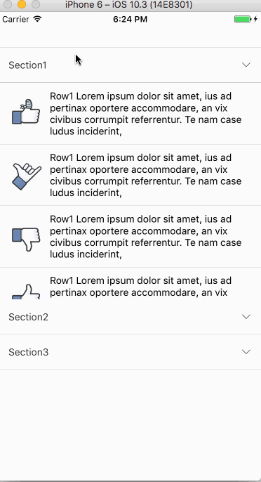

# react-native-accordions

A animated accordion component for React Native



## Note
This repo is inspired by [react-native-collapsible](https://github.com/oblador/react-native-collapsible), Rewrite it because that repo is out of maintain and mix a lot of unused code. Optimized the performance and write it with ESlint, make it easy to read and extend.

## Getting started
```bash
npm install react-native-accordions --save
```

## Properties

| Prop | Description | Default |
|---|---|---|
|**`renderHeader`**|The function for rendering the component header.|None|
|**`renderContent`**|The function for rendering the component content.|None|
|**`sections`**|The data for component for render.|None|
|**`underlayColor`**|The underlay color that will show through when tapping on header.| 'black' |